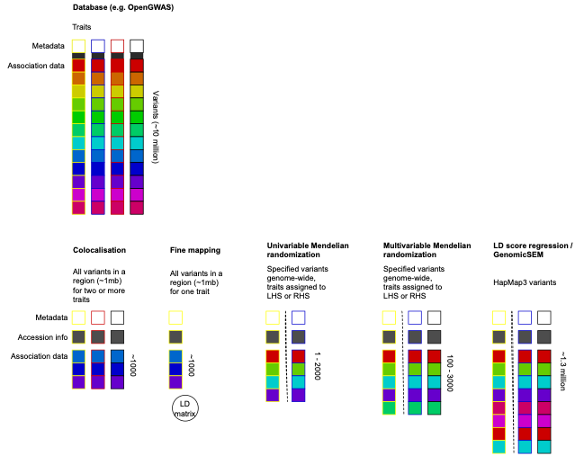
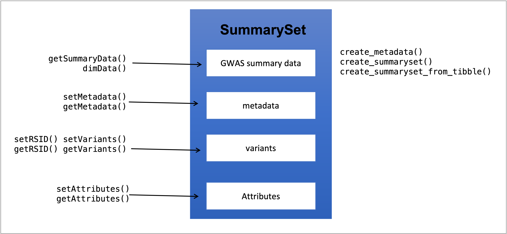
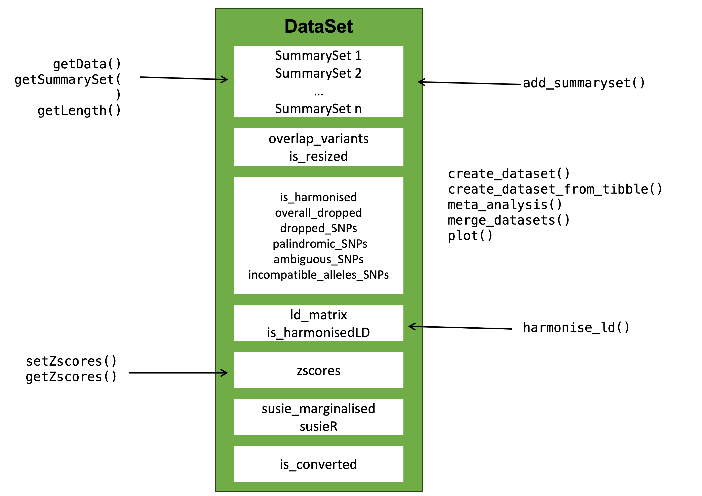

```{r, include = FALSE}
knitr::opts_chunk$set(
  collapse = TRUE,
  comment = "#>"
)
```

```{r setup}
library(gwasglue2)
```

The gwasglue2 package sits between the data and the analytical methods within the OpenGWAS ecosystem


## Objectives

- Represent GWAS summary data from multiple sources in various different shapes for different tools
- Represent a class structure that other packages can call
- Have very few dependencies
- Ensure harmonisation of data across different sources
- Be able to simulate data for ease of analytical prototyping
- Store relevant meta data
- Have methods for visualising, joining and subsetting datasets
- Create examples of analytical tools creating methods that import the gwasglue2 package.

Here are some example 'structures' of summary datasets that it should be able to handle

## Data structures



Note that the whole OpenGWAS database is an example of a 'complete' dataset - all traits and all variants. What we typically want to represent in gwasglue2 is a specific slice of that data, that is almost always going to be a rectangular shape - a set of variants across a set of traits. In addition, we need to be able to be able to flexibly associate metadata or other forms of annotations (LD matrices, genomic annotations etc) to the data. Finally, analytical tools need to be aware of these structures in order to easily deploy methods upon them.

## Work flow

This is typically how a workflow might look:


We should be able to ingest data from various locations, and then the class provides a number of different ways to manipulate and annotate the data.

## Strategy

A set of genetic associations (1 or more) for a single trait is known as a `SummarySet`. This class should contain the data, plus `MetaData` that describes the source study, plus a list of `Concept`s that annotate the Summary data.

A `Concept` is a named list of extra information that can be linked to the data, for example LD matrices, annotations relating to how to use the data in a model (e.g. exposure or outcome), etc.

A `Dataset` is a set of merged and harmonised `SummarySet`s, for example if two SummarySets are generated using the same set of variants for two traits, then putting them together into a `Dataset` will find the intersect of the available variants, and harmonise them to be on the same effect allele. `Dataset` objects can also have a global `Concept` list for extra data that is common across all the `SummarySet`s stored in the object.

Initial visualisation below:


## Implementation

Currently planning to implement as an S4 class, but may move into R7 in the future once it is stable and compatible with roxygen etc.

## Controlled fields

Association data within a `SummarySet` should have the following fields -

- Required:
  - chromosome
  - position
  - effect allele (ALT)
  - non-effect allele (REF)
  - effect size
  - standard error
  - p-value
- Optional:
  - effect allele frequency
  - rsid
  - imputation info score
  - sample size
  - number of cases
  - number of controls

Metadata fields -

- Required
  - genome build
  - units of effect size
  - number of cases
  - number of controls
  - trait name
  - trait identifier
  - ancestral population of sample
  - sex of sample
  - study DOI
  - number of variants

- Optional
  - Ontology term
  - standard deviation of trait
  - mean of trait
  - genotyping method
  - analysis method
  - covariates
  - notes

Accession info should be generated upon creation:

- Data source
- Timestamp of access
- Query


## Design

gwasglue2 has several constructors to build the `SummarySet` and `DataSet` objects, as well as getter and setter methods to add or retrieve information within. 

To build the `SummarySet` object, we need just one constructor function, the ``create_summaryset()``. It calls different `create_summaryset_from_`, depending of the source type of the GWAS summary data and also creates metadata using information from the summary data if none is given. It is also possible to build a metadata object using `create_metadata()`  and input it in `create_summaryset()`. Figure \@ref(fig:summaryset) shows the structure design of `SummarySet` with the getters and setters on the left and constructors on the right. 



For `DataSet` object we use the `create_dataset` constructor. If argument `harmonise = TRUE` it creates an harmonised `DataSet`. We use the function `harmonise_ld()` to harmonise the `DataSet` against a LD matrix from a reference population. With `add_summaryset()` it is possible to add an existent `SummarySet` to the `DataSet` and harmonise again. Two or more `DataSets` can also be merged together with `merge_datasets()`. The structure design for `DataSet` is in  Figure \@ref(fig:datasetset) with all the getters and setters on the left and constructors on the right. 



